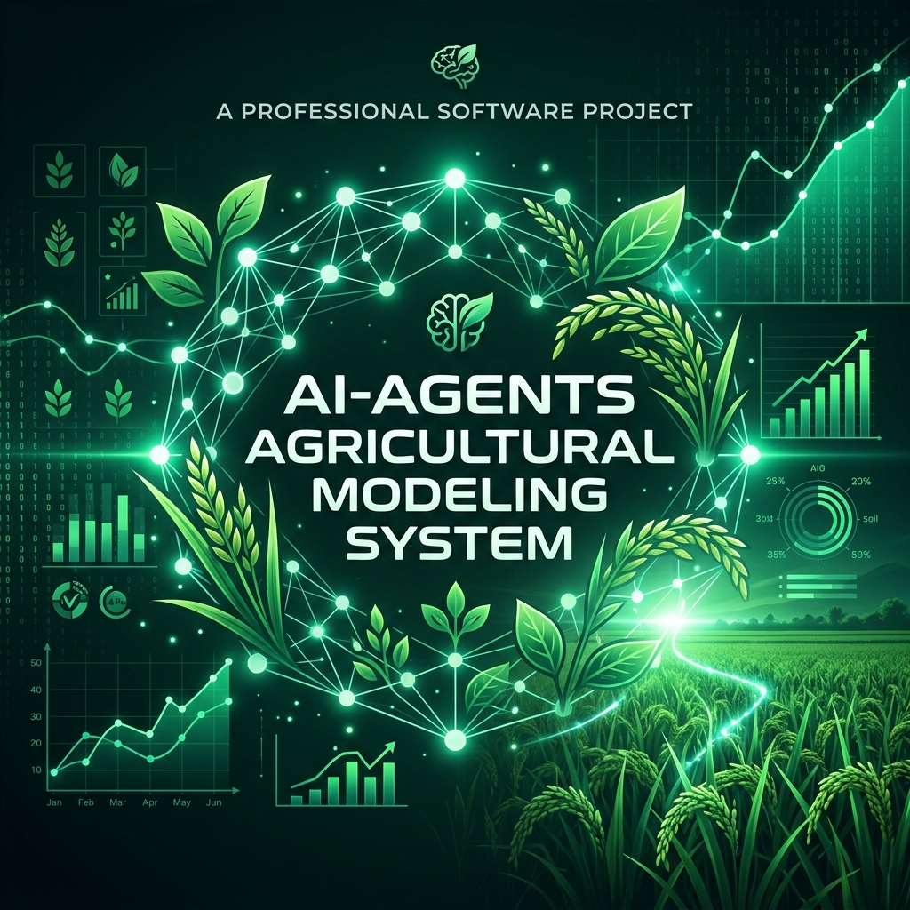
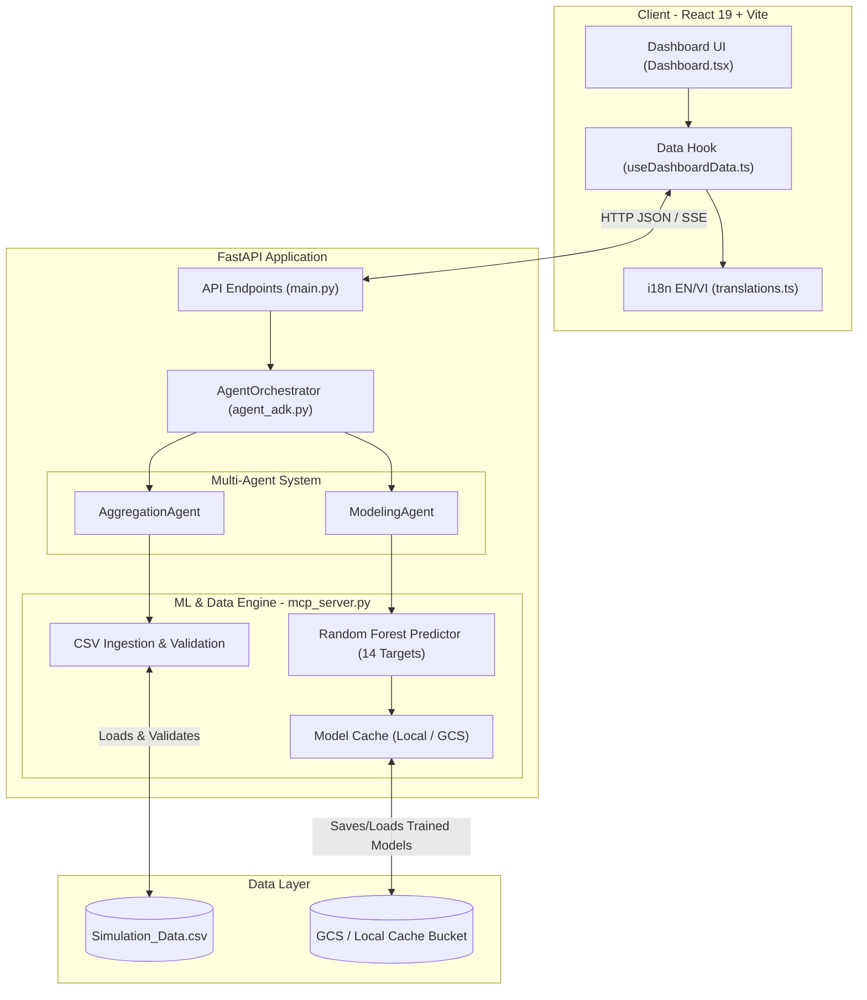
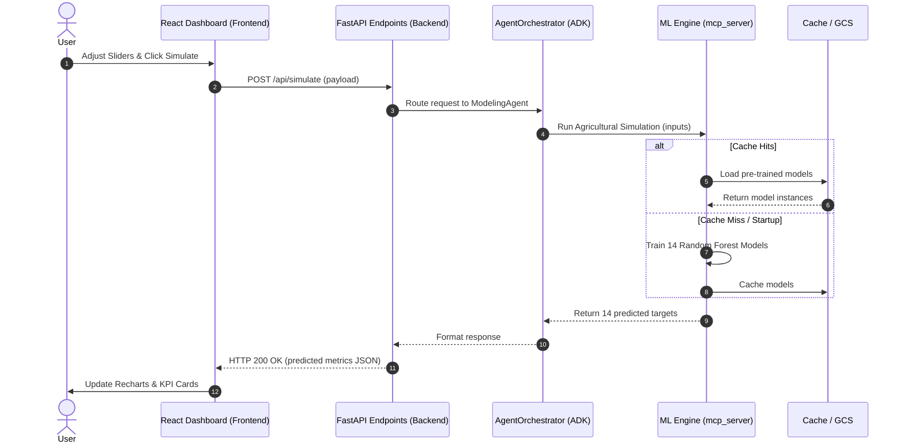

# AI-Agents Agricultural Modeling System

<p align="center">
  
</p>

An AI-powered multi-agent system and interactive simulation dashboard designed to analyze the impacts of agricultural practices (AWD adoption, water management, fertilizer/pesticide usage) on crop yields, methane emissions, net income, and profit margins — focused on rice farming scenarios in Vietnam.

---

## 📌 Deployment

- **Frontend URL:** [https://star-farm.vercel.app](https://star-farm.vercel.app)

---

## 🏗️ Architecture Overview

The system consists of three main layers: the bilingual frontend dashboard, the FastAPI middleware hosting the multi-agent system, and the core Machine Learning and Model Context Protocol (MCP) engine.



### 1. Interactive Dashboard (`frontend/`)
- Built with **React 19**, **TypeScript**, and **Vite**.
- **Bilingual UI** (Vietnamese 🇻🇳 / English 🇬🇧) with full i18n support.
- **KPI Cards**: Displays year-over-year percentage changes (2024 → 2050) for Avg Yield, Methane Emissions, Net Income, and Profit Margin.
- **Impact Comparison Chart** (`recharts`): Dual-axis bar charts toggling between Economic (Yield vs Net Income) and Environmental (Methane vs Emission Intensity) views.
- **Simulation Controls**: Interactive sliders and dropdowns for Scenario Group, AWD Adoption, Fertilizer (50–250 kg/ha), Pesticide (1–15 kg/ha), and Water Usage (200–1200 m³/ha).

### 2. Multi-Agent System (`backend/agent_adk.py`)
- Implements an Agent Development Kit (ADK) with an **AgentOrchestrator** routing queries to:
  - **AggregationAgent** (Agricultural Statistics Analyst): Groups and aggregates historical metrics across dimensions (Climate Type, Season Type, Scenario Group, AWD Adoption, Year, etc.).
  - **ModelingAgent** (Agricultural Yield & Emission Predictor): Runs simulations, single-target optimization (methane ceiling), and multi-resource grid-search optimization.

### 3. Model Context Protocol (MCP) Server (`backend/mcp_server.py`)
- Loads and validates `Simulation_Data.csv` at startup (schema validation, type checks).
- Trains **Random Forest** regression models (`scikit-learn`) for **14 prediction targets**.
- **Model caching**: Local cache + optional GCS bucket cache for faster cold starts.
- Exposes MCP tools: `get_data_status`, `get_scenarios`, `get_aggregated_metrics`, `run_agricultural_simulation`, `get_kpi_change`.

---

## 🔄 Interaction Sequence

Below is the workflow sequence of running a simulation from the frontend:



---

## 🛠️ Tech Stack

<p align="left">
  
  
  
  
  <br>
  
  
  
  
</p>

| Layer     | Technology                                            |
|-----------|-------------------------------------------------------|
| **Backend**   | Python 3.11+, FastAPI, Uvicorn, Pydantic, slowapi      |
| **ML Engine** | scikit-learn (Random Forest), pandas, NumPy            |
| **MCP**       | FastMCP (Model Context Protocol)                       |
| **Frontend**  | React 19, TypeScript, Vite, Recharts, Lucide React     |
| **DevOps**    | Docker, Vercel, Google Cloud Storage (GCS)             |

---

## 🔌 API Documentation

Detailed descriptions of key API endpoints:

### 1. Check Data Status
* **Endpoint:** `GET /api/data-status`
* **Description:** Check if the CSV dataset is correctly ingested and the machine learning models are trained and loaded.
* **Response (Success):**
  ```json
  {
    "status": "ready",
    "dataset_loaded": true,
    "models_trained": true,
    "model_cache": "local",
    "total_records": 12540
  }
  ```

### 2. Run Agricultural Simulation
* **Endpoint:** `POST /api/simulate`
* **Description:** Predict agricultural KPIs based on simulated inputs.
* **Request Body:**
  ```json
  {
    "scenario_group": "One Million Hectare Rice",
    "awd_adoption": "With AWD",
    "fertilizer": 120.5,
    "pesticide": 5.2,
    "water": 450.0
  }
  ```
* **Response:**
  ```json
  {
    "Avg Yield": 6.82,
    "Methane Emissions": 284.15,
    "Emission Intensity": 41.66,
    "Profit Margin": 42.5,
    "Net Income": 1250.0,
    "Production Cost": 1680.0,
    "Straw Value": 120.0,
    "Water Reliability": 85.0,
    "Biodiversity": 0.762,
    "Resilient Varieties": 75.0,
    "Labor Intensity": 140.0
  }
  ```

### 3. Resource Optimization under Methane Ceiling
* **Endpoint:** `POST /api/optimize`
* **Description:** Find optimal resource allocations meeting a specific methane emissions ceiling.
* **Request Body:**
  ```json
  {
    "methane_ceiling": 300.0,
    "scenario_group": "One Million Hectare Rice"
  }
  ```
* **Response:**
  ```json
  {
    "status": "optimized",
    "optimal_params": {
      "fertilizer": 100.0,
      "pesticide": 4.0,
      "water": 400.0,
      "awd_adoption": "With AWD"
    },
    "predicted_kpis": {
      "Avg Yield": 6.75,
      "Methane Emissions": 272.3,
      "Net Income": 1210.0
    }
  }
  ```

---

## 📁 Project Structure

```
├── backend/
│   ├── main.py                # FastAPI server, middleware, API endpoints
│   ├── mcp_server.py          # MCP server, data ingestion, ML model training
│   ├── agent_adk.py           # Multi-agent orchestrator (Aggregation + Modeling)
│   ├── requirements.txt       # Python dependencies
│   ├── Dockerfile             # Docker containerization (Python 3.11)
│   └── data/
│       └── Simulation_Data.csv  # Agricultural simulation dataset (~6.5 MB)
│
├── frontend/
│   ├── index.html             # HTML entry point
│   ├── package.json           # Node dependencies
│   ├── vite.config.ts         # Vite configuration
│   └── src/
│       ├── main.tsx           # React entry point
│       ├── App.tsx            # Root component
│       ├── Dashboard.tsx      # Main dashboard UI
│       ├── useDashboardData.ts  # Data fetching hook & chart logic
│       ├── translations.ts    # Vietnamese / English translations
│       ├── types.ts           # TypeScript type definitions
│       ├── config.ts          # API base URL config
│       ├── ErrorBoundary.tsx  # React error boundary
│       ├── index.css          # Global styles & design system
│       └── App.css            # Component styles
│
├── assets/
│   ├── banner.png             # Project header banner
│   └── dashboard_mockup.png   # Dashboard interface mockup
└── README.md                  # Project documentation
```

---

## 🛡️ Security Features

- **Rate Limiting**: Configurable per-minute rate limits via `slowapi`.
- **CORS**: Configurable allowed origins via `ALLOWED_ORIGINS` env variable.
- **Security Headers**: Custom security middleware enforcing `X-Content-Type-Options`, `X-Frame-Options`, `Referrer-Policy`, and `Content-Security-Policy`.
- **Input Validation**: Strict schema verification via Pydantic model constraints.

---

## 🚀 Setup & Execution Instructions

### 1. Backend Setup

The backend runs on **Python 3.11+**.

1. **Navigate to the backend directory**:
   ```bash
   cd backend
   ```
2. **Create and activate a virtual environment**:
   ```bash
   python -m venv .venv
   # Windows (PowerShell)
   .venv\Scripts\Activate.ps1
   # macOS / Linux
   source .venv/bin/activate
   ```
3. **Install dependencies**:
   ```bash
   pip install -r requirements.txt
   ```
4. **Start the FastAPI backend server**:
   ```bash
   python main.py
   ```
   The backend server starts at **`http://localhost:8080`**.

### 2. Frontend Setup

The frontend is a **React + TypeScript + Vite** application.

1. **Navigate to the frontend directory**:
   ```bash
   cd frontend
   ```
2. **Install Node dependencies**:
   ```bash
   npm install
   ```
3. **Run the frontend development server**:
   ```bash
   npm run dev
   ```
   The dashboard will be available at **`http://localhost:5173`**.
