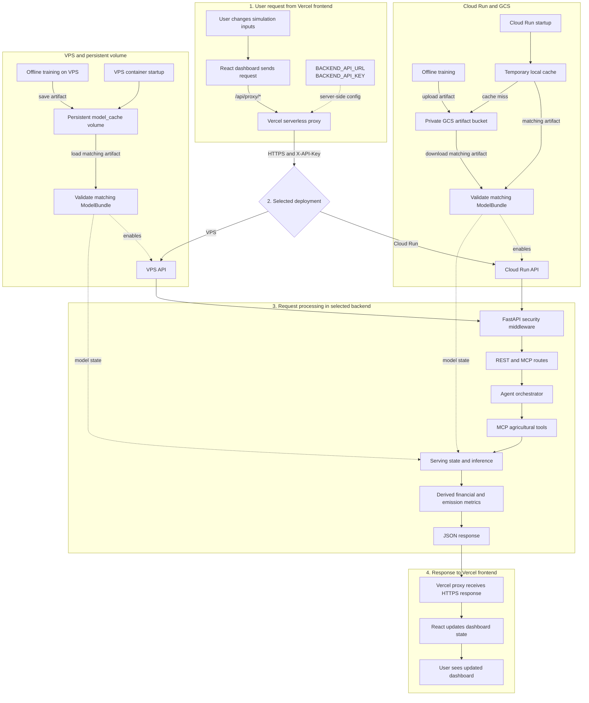
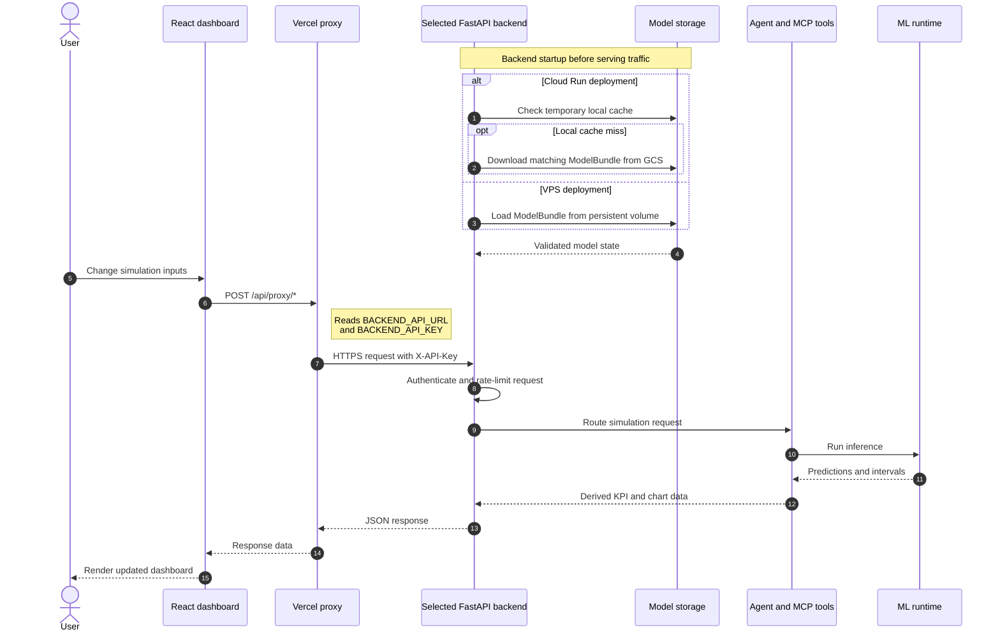

# Star Farm Web App

An agricultural dashboard that simulates how farming scenarios affect yield, emissions, and financial performance.

## Project Structure

| Service | Technology | Purpose |
| --- | --- | --- |
| [`frontend`](./frontend/) | React 19, TypeScript, Vite, Recharts | Dashboard and Vercel API proxy |
| [`backend`](./backend/) | Python, FastAPI, Random Forest | Cloud Run backend |
| [`VPS`](./VPS/) | Python, FastAPI, Docker Compose | VPS backend variant |

`backend` and `VPS` are two deployment variants of the same API. A production environment normally needs only one of them.

## Data Flow

### Production architecture



### Request sequence



The browser never receives the backend API key. The React application calls the same-origin Vercel proxy, which reads `BACKEND_API_KEY` server-side and forwards it as `X-API-Key`. `BACKEND_API_URL` selects either the Cloud Run or VPS deployment; the selected FastAPI service compares the forwarded key with `API_KEYS` before requests reach the agent and MCP layers.

- Random Forest models predict average yield, methane emissions, revenue, and production cost.
- Training is an explicit offline command; each serving variant loads a packaged `ModelBundle` and fails startup when it is unavailable or invalid.
- Net income, profit margin, and emission intensity are derived from those predictions.
- Simulation outputs use 2050 data and average equally across the unique valid resource, season, and climate combinations for the selected scenario.
- Validation residuals provide P90 prediction intervals for the simulation chart.
- The dashboard's default KPI comparison is 2022 to 2050.

## Local Development

### 1. Start the backend

```powershell
cd backend
python -m venv .venv
.\.venv\Scripts\Activate.ps1
pip install -r requirements.txt
Copy-Item .env.example .env
python -m app.ml.train
python main.py
```

The backend is available at `http://127.0.0.1:8080` by default.

### 2. Start the frontend

Open another terminal:

```powershell
cd frontend
npm install
npm run dev
```

Open the Vite URL shown in the terminal. The development proxy forwards `/api/proxy/*` to the local backend.

### Run the VPS variant with Docker

```powershell
cd VPS
Copy-Item .env.example .env
docker compose build api
docker compose run --rm api python -m app.ml.train
docker compose up -d
docker compose ps
Invoke-RestMethod http://127.0.0.1:8080/health
```

## Testing

```powershell
cd backend
python -m pytest

cd ..\VPS
python -m pytest

cd ..\frontend
npm test -- --run
npm run build
```

## Production Environment

The Vercel frontend requires at least:

```dotenv
BACKEND_API_URL=https://api.example.com
BACKEND_API_KEY=replace-with-a-strong-secret
```

The backend requires `API_KEYS`. See each service README for the complete configuration. Never store secrets in variables prefixed with `VITE_`, because those values may be included in the client bundle.

## Deployment Principles

- The production backend endpoint must use HTTPS.
- Cloud Run stores model cache in `/tmp` or Google Cloud Storage.
- The VPS container must bind to loopback and accept traffic only through a trusted reverse proxy.
- Enable `TRUST_PROXY_HEADERS` only when the proxy is controlled by you and direct backend access is impossible.
- `/health` is public; `/api/*` and `/mcp` require authentication.

## Detailed Documentation

- [Repository structure](./STRUCTURE.md)
- [Model inputs, formulas, evaluation, and P90 intervals](./MODEL.md)
- [Backend/Cloud Run](./backend/README.md)
- [Backend/VPS](./VPS/README.md)
- [Frontend/Vercel](./frontend/README.md)
