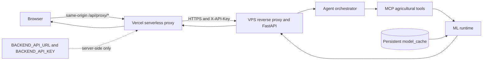

# Star Farm Web App

An agricultural dashboard that simulates how farming inputs affect yield, emissions, and financial performance. The repository currently contains one FastAPI backend in `VPS` and one React frontend in `frontend`.

## Project Structure

| Service | Technology | Purpose |
| --- | --- | --- |
| [`VPS`](./VPS/) | Python, FastAPI, Docker Compose | Model training, authenticated API, MCP tools, and inference |
| [`frontend`](./frontend/) | React 19, TypeScript, Vite, Recharts | Dashboard and authenticated Vercel API proxy |

The repository uses the VPS service as its backend. [GCS Setup](./GCS_SETUP.md) documents optional storage provisioning, but the current VPS code remains local-artifact-only until the optional integration in the [VPS guide](./VPS/README.md#optional-use-google-cloud-storage) is implemented.

## Production Data Flow


```mermaid
flowchart LR
    User[Browser] -->|same-origin /api/proxy/*| Proxy[Vercel serverless proxy]
    Env[BACKEND_API_URL and BACKEND_API_KEY] -. server-side only .-> Proxy
    Proxy -->|HTTPS and X-API-Key| API[VPS reverse proxy and FastAPI]
    API --> Agent[Agent orchestrator]
    Agent --> MCP[MCP agricultural tools]
    MCP --> Runtime[ML runtime]
    Volume[(Persistent model_cache)] --> Runtime
    Runtime --> API
    API --> Proxy
    Proxy --> User
```

The browser never receives the backend API key. The Vercel proxy reads it from server-side configuration and forwards it to the VPS API. In production, the VPS container binds to loopback and is exposed only through an HTTPS reverse proxy.

## Model and Dashboard Behavior

- Offline training produces a fingerprinted `ModelBundle`; serving never trains.
- Startup fails if the local artifact is missing, invalid, or does not match the CSV fingerprint and model version.
- Random Forest models predict average yield, methane emissions, revenue, and production cost.
- Net income, profit margin, and emission intensity are derived from those predictions.
- Simulations use 2050 data and average equally across unique resource, season, and climate combinations for the selected scenario.
- Validation residuals provide P90 intervals for simulation charts.
- KPI changes compare 2050 with 2022; the KPI panel displays only unfavorable changes.
- Simulation Estimates explicitly state that 2050 results are compared with 2022.

See [Model Documentation](./MODEL.md) for formulas and evaluation details.

## Local Development

### Start the backend

```powershell
cd VPS
python -m venv .venv
.\.venv\Scripts\Activate.ps1
pip install -r requirements.txt
Copy-Item .env.example .env
python -m app.ml.train
python main.py
```

The API is available at `http://127.0.0.1:8080` by default.

### Start the frontend

Open another terminal:

```powershell
cd frontend
npm install
npm run dev
```

The development proxy forwards `/api/proxy/*` to the local API.

### Run the VPS deployment with Docker

```powershell
cd VPS
Copy-Item .env.example .env
docker compose build api
docker compose run --rm api python -m app.ml.train
docker compose up -d
docker compose ps
Invoke-RestMethod http://127.0.0.1:8080/health
```

## Testing

```powershell
cd VPS
python -m pytest

cd ..\frontend
npm test -- --run
npm run build
```

## Production Environment

Vercel requires:

```dotenv
BACKEND_API_URL=https://api.example.com/api/
BACKEND_API_KEY=replace-with-a-strong-secret
REQUIRE_HTTPS_BACKEND=true
```

The VPS API requires the matching `API_KEYS` value. Never store secrets in `VITE_*` variables because those may be included in the browser bundle.

## Deployment Principles

- Use HTTPS for the production backend endpoint.
- Bind the VPS container to `127.0.0.1:8080` and place it behind Nginx or Caddy.
- Enable `TRUST_PROXY_HEADERS` only behind a controlled proxy that overwrites forwarded headers.
- Keep model artifacts in the persistent `model_cache` volume unless optional GCS support has been implemented.
- `/health` is public; `/api/*` and `/mcp` require authentication.

## Documentation

- [Repository structure](./STRUCTURE.md)
- [Model inputs, formulas, evaluation, and P90 intervals](./MODEL.md)
- [VPS deployment](./VPS/README.md)
- [Frontend and Vercel](./frontend/README.md)
- [Optional GCS setup](./GCS_SETUP.md)
- [Data Studio and optional geospatial pipeline](../Data%20Studio%20guide/README.md)
